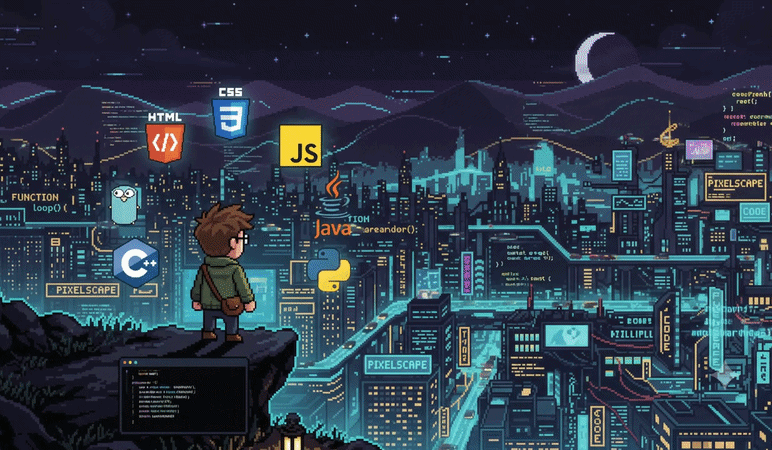

<!-- Embedded Moving Tech Animation Asset -->

  

  
  

---

## 🚀 About Me
I am a results-driven **Software Developer** specializing in full-stack web/mobile development and advanced AI workflow automation. I bridge the gap between robust software engineering and smart automation pipelines to put business processes on autopilot.

---

## 🛠️ Tech Stack & Ecosystem

### 💻 Languages & Frameworks (Hover to Animate)

  

### ⚙️ Automation, Cloud & Databases

  

  
  

---

## ⚡ Highlighted AI & Automation Projects

*   **🤖 Autonomous AI Expense Bookkeeper**  
    Built a fully automated serverless pipeline that extracts structured financial data from email invoice attachments (PDFs/Images) and logs them into a centralized ledger in real-time. Combines event-driven orchestration with an LLM data extraction engine.
    
*   **📈 Multi-Channel AI Sentiment Engine**  
    Designed a live backend automation architecture that streams real-time customer feedback data, processes it via an LLM to evaluate emotional sentiment, and dynamically triages critical complaints into dedicated communication pipelines.
    
*   **🐷 Carnalyze (Thesis Project)**  
    Developed a Python-powered hardware–software system utilizing sensors and predictive modeling to assess pork meat freshness through real-time data management.

*   **✈️ AirWeGo**  
    Developed a flight booking mobile application featuring ticket reservations and an AI support chatbot to streamline the user experience.

---

## 📜 Certifications

  
  
  

---

## 🎨 Featured Showcase

  

---

### 🤝 Let's Connect!
I am actively seeking entry-level opportunities in **Software Development**, **Junior Java Roles**, and **AI/Backend Automation engineering**. Let's build something amazing!

[📬 Drop me a message on LinkedIn!](https://linkedin.com/in/j078)
